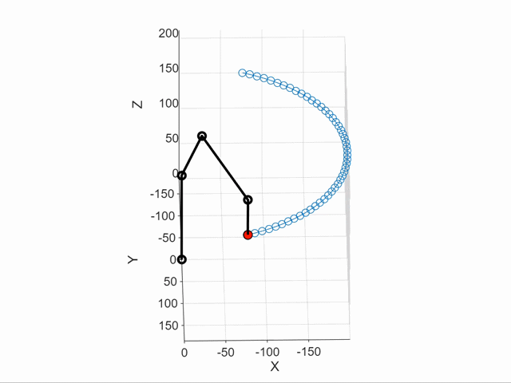

# 6-DOF Robot Project (Currently 4-DOF)

This repository contains the firmware and simulation files for a 6-degree-of-freedom (DOF) robot, currently implemented with 4 active DOFs. The project includes live inverse kinematics computation on an STM32 microcontroller, allowing real-time control via UART or a joystick.

---

## Features

### Matlab model
The robot model was developed using Denavit-Hartenberg (DH) matrix notation in MATLAB.

### DOF control with live inverse kinematics
Inverse kinematics are computed on-the-fly using Nelder–Mead optimization implemented on the STM32

### Joystick input

### UART commands

### Internal state machine
The robot’s behavior is controlled by an internal state machine, which includes:

- R_START: Start position (currently the same as R_ZERO).
The robot initializes in this state upon startup.

- R_BASE: Move to the base position.
In this temporary state, the robot moves to a predefined base position and then switches to the inverse kinematics mode.

- R_IK: Main inverse kinematics state.
In this state, the robot’s position can be controlled in real-time via the joystick or UART commands.

- R_CMD_POS: Joint command position.
In this state, the controller rotates each joint individually according to the positions provided via UART commands.

- R_ZERO: Zero position.
All joints move to their respective zero positions.

### Display of current state
The OLED display shows the current state of the robot. Example:

Start
Press BASE btn

Inverse Kinematics:
P: 200,200,200
K: 200,200,200

---

## Repository

Repository Structure
/simulations   # MATLAB files for model implementation and simulation
/src           # STM32 firmware

Simulations
Contains MATLAB scripts used to derive the robot model and perform simulations.

Firmware
STM32 implementation includes:

- Nelder-Mead method optimization

- State machine logic

- UART and joystick control

- Display interface

---

## To-Do / Future Work

- Replace current servos with higher quality units.

- Upgrade microcontroller to dual-core STM32H7 for improved performance.

- Add effector ( additional 2 degrees of freedom )

- Implement out-of-workspace detection and recovery algorithm by searching solution space in the neighbourhood.

---

## Known Issues

- Current microcontroller may struggle with complex IK calculations for 6-DOF.

- If the robot moves outside the workspace, it may not automatically recover — planned algorithm will search neighbourhood of current solution.

---

## References
- https://s3.amazonaws.com/nrbook.com/book_C210.html
- https://robotyka.pl/teoria/teoria-robotyki/
- https://staff.uz.zgora.pl/wpaszke/materialy/air/PRwyklad_4.pdf 

---

## Assets

### Trajectory test (gif)

### Youtube videos
https://www.youtube.com/playlist?list=PLLbGYqHAyf1fbl_TrEpRQ8hpMJwUmI0mh